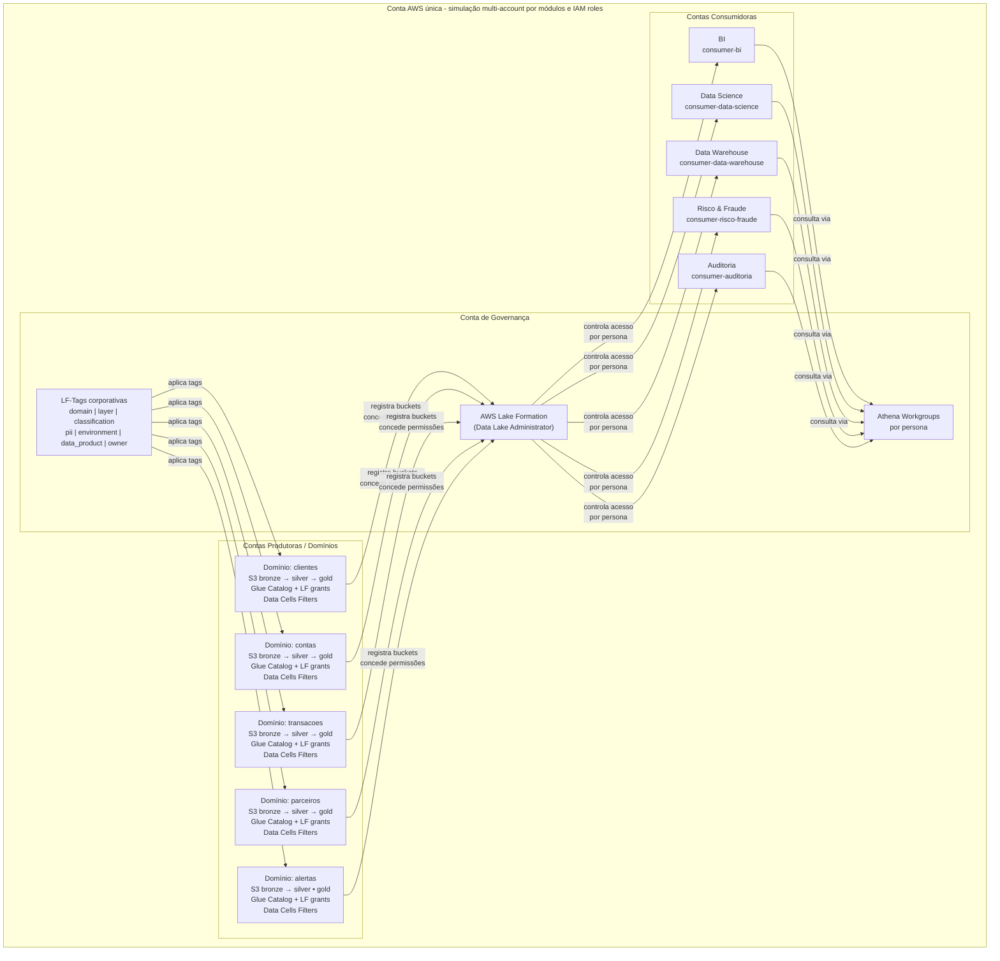

# AWS Lake Formation Data Mesh — referência em conta única

Este projeto Terraform implementa uma versão **econômica e executável em uma única conta AWS** da arquitetura de referência:

- Conta de Governança — representada por módulo `foundation`
- Contas Produtoras / Domínios — representadas por módulos independentes por domínio
- Contas Consumidoras — representadas por IAM roles, Athena Workgroups e permissões Lake Formation

Domínios incluídos:

- `clientes`
- `contas`
- `transacoes`
- `parceiros`
- `alertas`

> Objetivo: permitir que você valide o padrão de governança, catálogo, S3, Glue, Lake Formation, LF-Tags e filtros de acesso sem precisar criar múltiplas contas AWS.

---

## Visão lógica



---

## O que este projeto cria

### Foundation

Cria recursos centrais e baratos:

- Lake Formation Data Lake Settings
- LF-Tags corporativas
- IAM roles de consumidores:
  - `consumer-bi`
  - `consumer-data-science`
  - `consumer-data-warehouse`
  - `consumer-risco-fraude`
  - `consumer-auditoria`
- Bucket de resultados do Athena
- Athena Workgroups por persona

### Cada domínio

Cada domínio pode ser aplicado de forma independente.

Cada domínio cria:

- 3 buckets S3 por camada: `bronze`, `silver`, `gold`
- 3 Glue Databases por camada: ex. `dev_bronze_clientes`, `dev_silver_clientes`, `dev_gold_clientes`
- Glue Tables externas CSV com dados de exemplo em cada camada
- Registro dos buckets no Lake Formation (com `s3:ListAllMyBuckets` para verificação)
- IAM role do produtor e IAM roles de registro (lf-register) por camada
- LF-Tags nos databases e tabelas
- Grants Lake Formation para consumidores (DESCRIBE nos databases, SELECT nas tabelas gold)
- Data Cells Filters para restringir colunas e/ou linhas por persona

---

## Pré-requisitos

- Terraform `>= 1.6`
- AWS Provider `>= 6.32, < 7.0`
- AWS CLI configurado
- Permissões para criar IAM, S3, Glue, Athena e Lake Formation
- O principal que executa Terraform deve ser **Data Lake Administrator** no Lake Formation ou conseguir se tornar um via `aws_lakeformation_data_lake_settings`

> Se você usa AWS SSO/Identity Center, normalmente o `data.aws_caller_identity.current.arn` retorna uma ARN de sessão STS. Para produção ou ambiente mais controlado, defina `lakeformation_admin_arns` com a ARN real do IAM role administrativo.

---

## Ordem recomendada de deploy

### 0. Consumer Roles

Primeiro, crie as roles realistas que simulam usuários e aplicações de contas consumidoras:

```bash
cd envs/dev/consumer-roles
cp terraform.tfvars.example terraform.tfvars
terraform init
terraform plan
terraform apply

# Copie os ARNs do output
terraform output all_consumer_role_arns
```

### 1. Foundation

```bash
cd ../foundation
cp terraform.tfvars.example terraform.tfvars

# IMPORTANTE: Edite terraform.tfvars e cole os ARNs das consumer roles
# que você obteve no passo anterior

terraform init
terraform plan
terraform apply
```

### 2. Domínios, um por vez

```bash
cd ../domains/clientes
cp terraform.tfvars.example terraform.tfvars
terraform init
terraform plan
terraform apply
```

Depois repita para:

```bash
../contas
../transacoes
../parceiros
../alertas
```

Também pode usar o Makefile na raiz:

```bash
make init-consumer-roles
make apply-consumer-roles

make init-foundation
make apply-foundation

make init-domain DOMAIN=clientes
make apply-domain DOMAIN=clientes
```

---

## Como validar no Athena

1. Aplique a foundation.
2. Aplique pelo menos os domínios `clientes`, `contas` e `transacoes`.
3. No console AWS, acesse Athena.
4. Escolha o workgroup criado, por exemplo:

```text
lfmesh-dev-bi
lfmesh-dev-data-science
lfmesh-dev-risco-fraude
lfmesh-dev-auditoria
```

5. Consulte uma tabela (as tabelas gold usam o padrão `dev_gold_<dominio>`):

```sql
SELECT * FROM dev_gold_clientes.cliente_360;
```

6. Teste um join:

```sql
SELECT
  c.cliente_id,
  c.segmento,
  a.tipo_conta,
  t.valor,
  t.categoria
FROM dev_gold_clientes.cliente_360 c
JOIN dev_gold_contas.contas_ativas a
  ON c.cliente_id = a.cliente_id
JOIN dev_gold_transacoes.transacoes_curated t
  ON a.conta_id = t.conta_id;
```

---

## Observação sobre custo

Por padrão este projeto evita serviços de custo maior como:

- Amazon DataZone
- Amazon Macie
- Redshift
- SageMaker
- Kinesis
- MSK
- Glue Crawlers
- Glue Jobs

Ele cria majoritariamente recursos de control plane e S3 com poucos objetos CSV pequenos.

**Custo estimado: < $0.15/mês** 💰

Veja detalhes completos em [docs/CUSTOS.md](docs/CUSTOS.md)

### 🧹 Limpeza completa após estudos

**IMPORTANTE**: Para evitar qualquer cobrança, execute a limpeza completa:

```bash
# Linux/Mac
./cleanup.sh

# Windows  
cleanup.bat

# Ou via Makefile
make cleanup
```

O script destroi TODOS os recursos na ordem correta.

Ainda assim, sempre rode:

```bash
terraform plan
```

E destrua o que não for usar:

```bash
terraform destroy
```

---

## Limitações do lab em conta única

Este projeto simula multi-account usando:

- diretórios Terraform separados
- estados separados
- IAM roles diferentes
- naming convention
- grants Lake Formation por persona

Em uma empresa real, você trocaria essa simulação por:

- AWS Organizations
- AWS Control Tower
- contas separadas por domínio
- AWS RAM para cross-account sharing
- Resource Links em contas consumidoras
- centralização de logs em Log Archive Account
- Security Account dedicada

---

## Estrutura

```text
.
├── Makefile
├── cleanup.sh                    # 🧹 Script de limpeza Linux/Mac
├── cleanup.bat                   # 🧹 Script de limpeza Windows
├── modules
│   ├── consumer-roles               # 🎭 Roles de usuários/apps consumidores
│   ├── foundation
│   └── domain
└── envs
    └── dev
        ├── consumer-roles           # 👥 Deploy das roles consumidoras
        ├── foundation
        └── domains
            ├── clientes
            ├── contas
            ├── transacoes
            ├── parceiros
            └── alertas
```
