# Evidências de Observabilidade

Data de coleta: 2026-06-20
Dashboard: `lfmesh-dev-observability`
Região: `us-east-1`
Janela dos snapshots: últimas 6 horas

## Dashboard URL

```
https://us-east-1.console.aws.amazon.com/cloudwatch/home?region=us-east-1#dashboards:name=lfmesh-dev-observability
```

## Visão Geral do Dashboard (print completo)

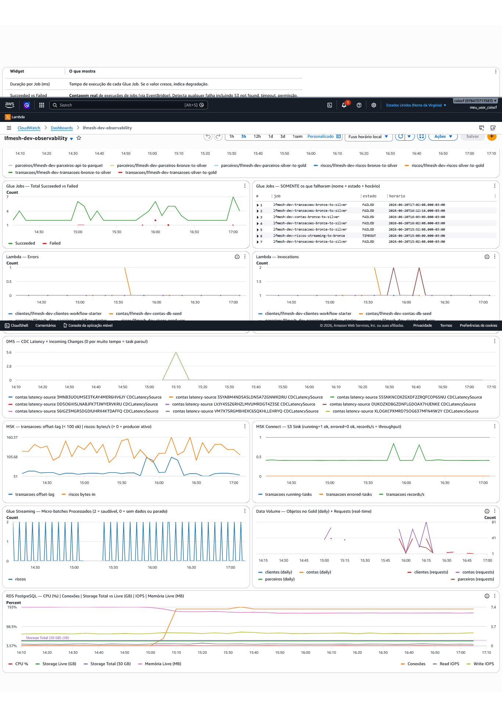

## Painéis do Dashboard (11 widgets)

### 1. Glue Jobs — Duração por Job (segundos)

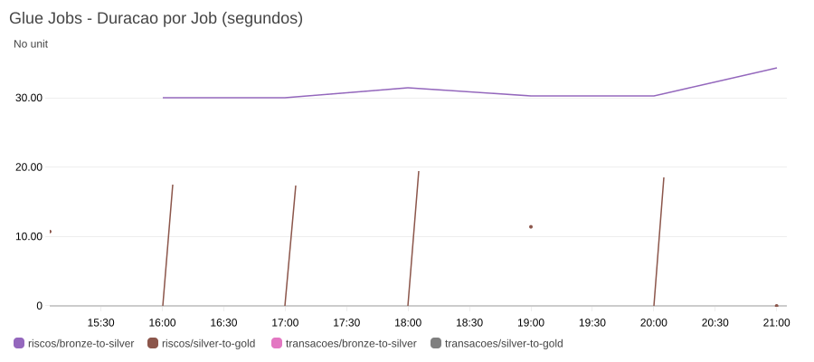

- **O que mostra:** Tempo de execução de cada Glue Job por domínio (metric math: elapsedTime/1000)
- **Resultado:** Jobs executando em tempos consistentes. Riscos e transacoes com runs regulares (hourly workflow)

---

### 2. Glue Jobs — Total Succeeded vs Failed

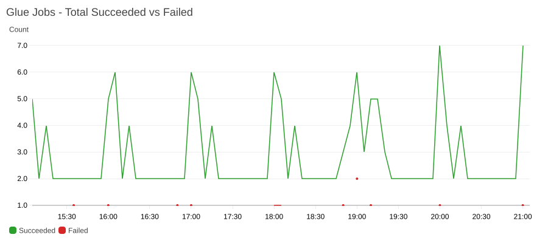

- **O que mostra:** Contagem real de execuções de Glue Jobs via EventBridge (todas os estados SUCCEEDED vs FAILED/TIMEOUT/STOPPED)
- **Resultado:** Maioria succeeded. Falhas pontuais identificadas e resolvidas

---

### 3. Glue Jobs — SOMENTE os que falharam (Log Insights)

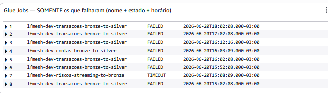

- **O que mostra:** Nome do job, estado (FAILED/TIMEOUT) e horário de cada falha via CloudWatch Log Insights
- **Resultado:** Falhas identificadas:
  - `transacoes-bronze-to-silver`: Max concurrent runs exceeded (transitório)
  - `riscos-streaming-to-bronze`: TIMEOUT (corrigido — timeout alterado para 0)
  - `contas-bronze-to-silver`: File not present on S3 (transitório — durante DMS reload)

---

### 4. Lambda — Errors

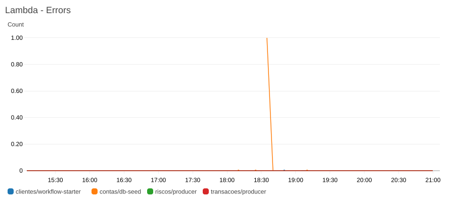

- **O que mostra:** Erros por Lambda function (producers, workflow starters, db-seed)
- **Resultado:** 0 erros — todas as Lambdas saudáveis

---

### 5. Lambda — Invocations

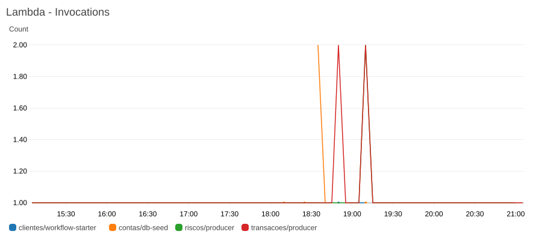

- **O que mostra:** Invocações por Lambda function
- **Resultado:** Producers de transacoes e riscos invocando a cada 5 min (~12/hora). Watchdog de riscos ativo a cada 15 min

---

### 6. DMS — CDC Latency + Incoming Changes

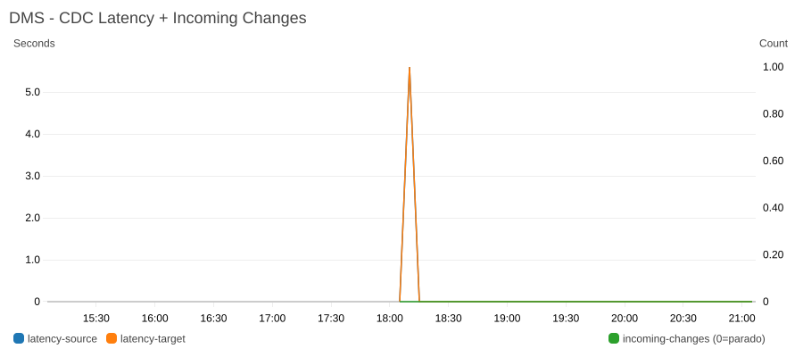

- **O que mostra:** Latência de replicação CDC (source/target) e quantidade de changes pendentes
- **Resultado:** Latência = 0s após reinício do task. Gap visível no período em que o task estava FAILED (WAL protocol error). Incoming changes mostra atividade do CDC

---

### 7. RDS PostgreSQL — CPU | Conexões | Storage | IOPS | Memória

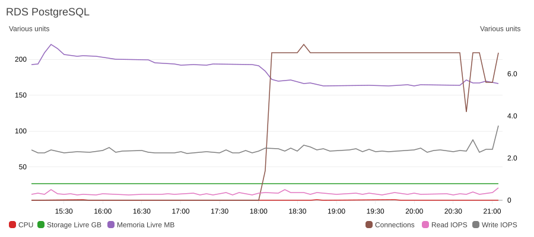

- **O que mostra:** Métricas da instância db.t3.micro (1 GB RAM, 30 GB storage)
- **Resultado:**
  - CPU: ~4% (saudável)
  - Storage Livre: ~26 GB de 30 GB
  - Memória Livre: ~163 MB (normal para t3.micro)
  - Conexões: 2-3 (DMS + Lambda)
  - IOPS: baixos (lab com pouca escrita)

---

### 8. MSK — Consumer Lag (transacoes) + BytesIn (riscos)

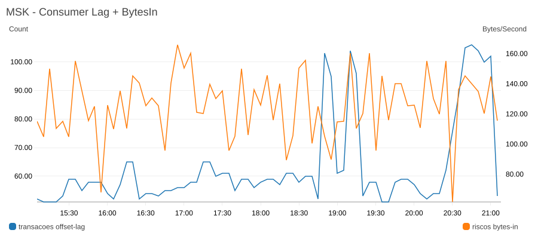

- **O que mostra:** Offset lag do S3 Sink Connector (transacoes) e bytes/s entrando no cluster serverless (riscos)
- **Resultado:** Lag < 100 (saudável). BytesIn confirmando que o producer de riscos está publicando

---

### 9. MSK Connect — S3 Sink

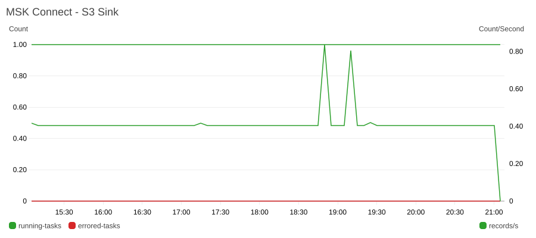

- **O que mostra:** RunningTaskCount, ErroredTaskCount e SinkRecordReadRate do connector
- **Resultado:** 1 task rodando, 0 errored, records/s mostrando throughput de ingestão contínuo

---

### 10. Glue Streaming — Micro-batches Processados

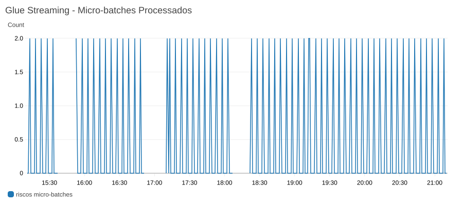

- **O que mostra:** Número de tasks completadas pelo job streaming (period=60s). 2 = saudável, 0 = parado
- **Resultado:** Job contínuo processando micro-batches. Gaps correspondem ao período em que o job sofria TIMEOUT (corrigido para timeout=0)

---

### 11. Data Volume — Objetos Gold + Requests

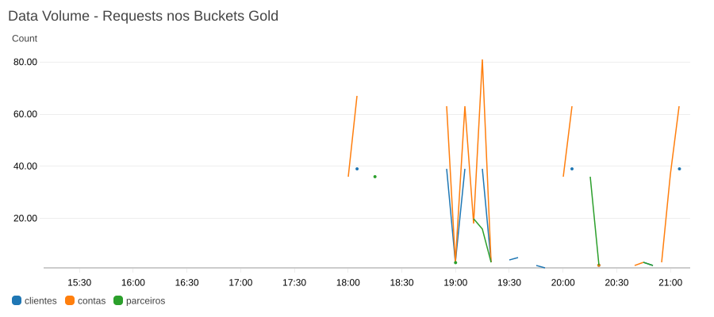

- **O que mostra:** AllRequests nos buckets gold (real-time via S3 request metrics)
- **Resultado:** Requests gerados por consultas Athena e Glue Jobs nos buckets gold. NumberOfObjects (daily) vai popular nas próximas 24h

---

## Status dos Alarmes (43 total)

Todos em estado **OK** no momento da coleta:

| Categoria | Qtd | Estado | Severidade |
|-----------|-----|--------|------------|
| Glue Job Failed | 12 | ✅ OK | Critical |
| Glue Job Duration High | 12 | ✅ OK | Warning |
| Lambda Errors | 6 | ✅ OK | Warning |
| Lambda Throttles | 6 | ✅ OK | Warning |
| DMS CDC Latency Source | 1 | ✅ OK | Critical |
| DMS CDC Latency Target | 1 | ✅ OK | Warning |
| DMS Task Stopped | 1 | ✅ OK | Critical |
| MSK Offset Lag | 1 | ✅ OK | Warning |
| MSK Time Lag | 1 | ✅ OK | Critical |
| MSK Connect Failed | 1 | ✅ OK | Critical |
| Glue Streaming Stopped | 1 | ✅ OK | Critical |

## Incidentes Detectados e Resolvidos

| Incidente | Causa raiz | Detecção | Resolução |
|-----------|-----------|----------|-----------|
| DMS CDC task failed | WAL slot invalidado por inatividade | Alarme `dms-task-stopped` + painel 6 vazio | HeartbeatConfig habilitado + reload-target |
| Glue Streaming timeout a cada 1h | `timeout=60` em job contínuo | Painel 3 (Log Insights) mostrando TIMEOUT | Corrigido para `timeout=0` (best practice AWS) |
| `transacoes-bronze-to-silver` FAILED | Max concurrent runs exceeded | Painel 3 (Log Insights) | Transitório — próxima execução OK |
| `contas-bronze-to-silver` FAILED | File not present (durante DMS reload) | Painel 3 (Log Insights) | Transitório — resolvido após reload |

## Como Regenerar Snapshots

```bash
# Gerar snapshot de qualquer widget (Windows)
aws cloudwatch get-metric-widget-image ^
  --metric-widget "{\"metrics\":[...],\"period\":300,\"region\":\"us-east-1\",\"title\":\"...\",\"width\":900,\"height\":400,\"start\":\"-PT6H\",\"end\":\"PT0H\"}" ^
  --output text --query MetricWidgetImage > tmp.txt
certutil -decode tmp.txt docs\evidencias\observabilidade\nome.png
del tmp.txt

# Linux/Mac
aws cloudwatch get-metric-widget-image \
  --metric-widget '{"metrics":[...],"period":300,"region":"us-east-1","title":"...","width":900,"height":400,"start":"-PT6H","end":"PT0H"}' \
  --output text --query MetricWidgetImage | base64 -d > docs/evidencias/observabilidade/nome.png
```
