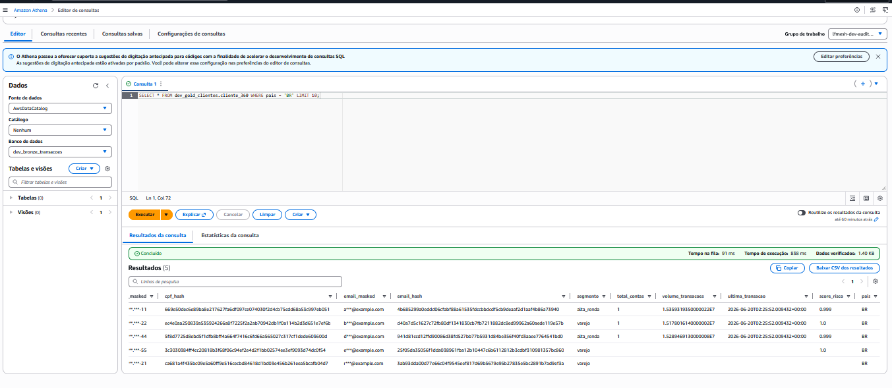
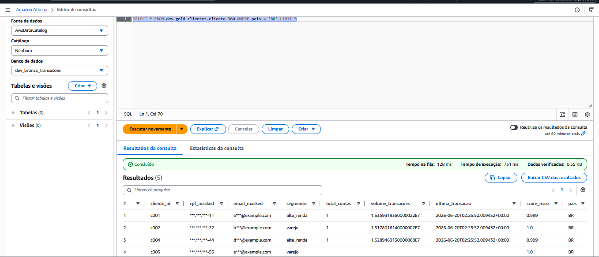
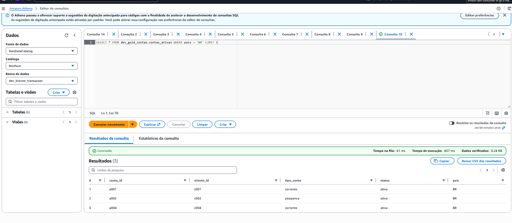
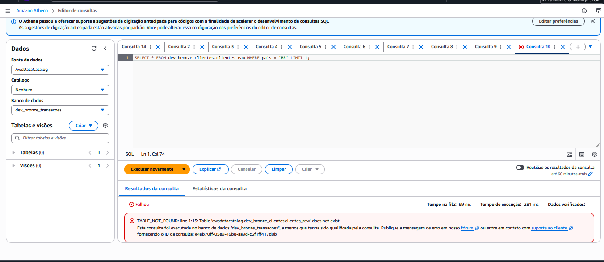
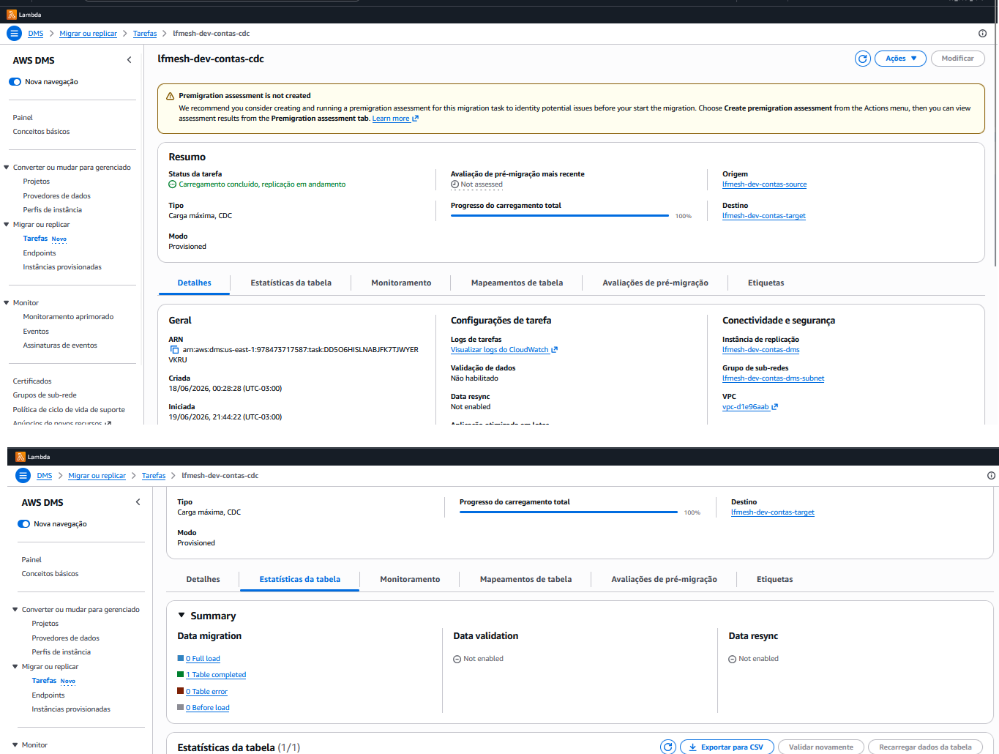
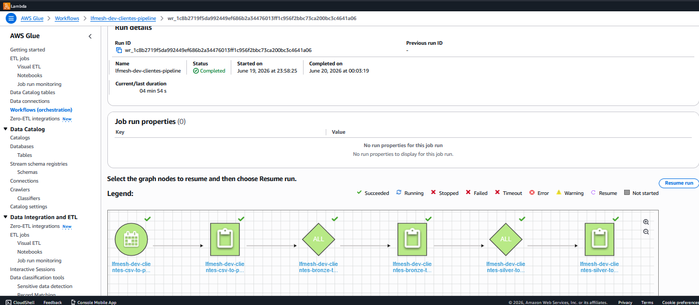
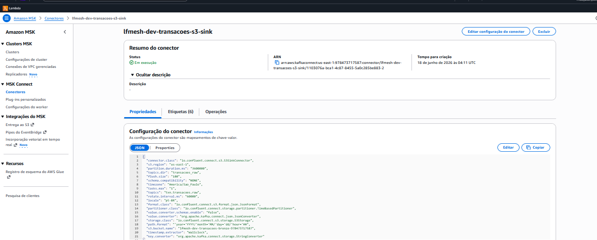
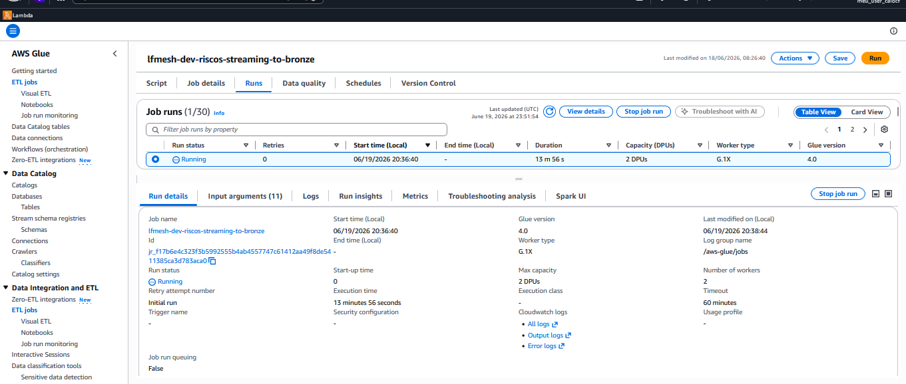

# Validacao End-to-End

Este documento registra os testes executados para validar o funcionamento completo do lab, incluindo pipelines de ingestao, mascaramento de PII e governanca com Lake Formation.

## Pre-requisitos

- Lab deployado (`foundation` + `network` + dominios)
- AWS CLI autenticado com perfil admin do Lake Formation
- Dominios `clientes` e `contas` com workflows executados ao menos 1x

---

## 1. Pipeline clientes — visao 360 com dados cross-dominio e mascaramento PII

### Comando

```bash
# Workgroup: lfmesh-dev-auditoria (admin full access)
aws athena start-query-execution \
  --query-string "SELECT * FROM dev_gold_clientes.cliente_360 WHERE pais = 'BR' LIMIT 5" \
  --work-group "lfmesh-dev-auditoria"
```

### Resultado esperado

- Coluna `cpf_masked` com formato `***.***.***-XX` (ultimos 2 digitos visiveis)
- Coluna `email_masked` com formato `x***@dominio`
- Coluna `cpf_hash` e `email_hash` com SHA256 de 64 caracteres (hash com salt)
- Colunas `cpf` e `email` originais **nao existem** na tabela
- `total_contas` preenchido com dados reais do dominio `contas` (join por cliente_id)
- `volume_transacoes` e `ultima_transacao` preenchidos com dados reais do dominio `transacoes`
- `score_risco` preenchido com max score do dominio `riscos`

### Resultado obtido

| cliente_id | nome | cpf_masked | segmento | total_contas | volume_transacoes | ultima_transacao | score_risco |
|---|---|---|---|---|---|---|---|
| c001 | Ana Silva | ***.***.***-11 | alta_renda | 1 | ~15.3M | 2026-06-20T02:25 | 0.999 |
| c002 | Bruno Souza | ***.***.***-22 | varejo | 1 | ~15.1M | 2026-06-20T02:25 | 1.0 |
| c004 | Daniel Rocha | ***.***.***-44 | alta_renda | 1 | ~15.2M | 2026-06-20T02:25 | 0.999 |
| c005 | Elena Martins | ***.***.***-55 | varejo | - | - | - | 1.0 |
| c011 | Roberto Costa | ***.***.***-21 | varejo | - | - | - | - |

Clientes sem dados nos dominios de contas/transacoes/riscos ficam com NULL (left join).

### Screenshot



---

## 2. Governanca — BI sem colunas sensiveis (clientes)

### Comando

```bash
# Assume role BI
aws sts assume-role --role-arn arn:aws:iam::<ACCOUNT_ID>:role/lfmesh-dev-consumer-bi --role-session-name bi-test

# Workgroup: lfmesh-dev-bi
aws athena start-query-execution \
  --query-string "SELECT * FROM dev_gold_clientes.cliente_360 WHERE pais = 'BR' LIMIT 5" \
  --work-group "lfmesh-dev-bi"
```

### Resultado esperado

- Visiveis: `cliente_id`, `cpf_masked`, `email_masked`, `segmento`, `total_contas`, `volume_transacoes`, `ultima_transacao`, `score_risco`, `pais`
- **Excluidas** pelo Data Cells Filter: `nome`, `cpf_hash`, `email_hash`

### Resultado obtido

Colunas retornadas:
```
cliente_id, cpf_masked, email_masked, segmento, total_contas, volume_transacoes, ultima_transacao, score_risco, pais
```

Confirmado: `nome`, `cpf_hash` e `email_hash` nao aparecem no resultado.

### Screenshot



---

## 3. Governanca — BI sem saldo (contas)

### Comando

```bash
# Assume role BI
aws sts assume-role --role-arn arn:aws:iam::<ACCOUNT_ID>:role/lfmesh-dev-consumer-bi --role-session-name bi-contas

# Workgroup: lfmesh-dev-bi
aws athena start-query-execution \
  --query-string "SELECT * FROM dev_gold_contas.contas_ativas WHERE pais = 'BR' LIMIT 5" \
  --work-group "lfmesh-dev-bi"
```

### Resultado esperado

- Visiveis: `conta_id`, `cliente_id`, `tipo_conta`, `status`, `pais`
- **Excluida** pelo Data Cells Filter: `saldo`

### Resultado obtido

Colunas retornadas:
```
conta_id, cliente_id, tipo_conta, status, pais
```

Confirmado: `saldo` nao aparece para a persona BI.

### Screenshot



---

## 4. Governanca — acesso negado a camada bronze

### Comando

```bash
# Assume role BI
aws sts assume-role --role-arn arn:aws:iam::<ACCOUNT_ID>:role/lfmesh-dev-consumer-bi --role-session-name bi-blocked

# Workgroup: lfmesh-dev-bi
aws athena start-query-execution \
  --query-string "SELECT * FROM dev_bronze_clientes.clientes_raw WHERE pais = 'BR' LIMIT 1" \
  --work-group "lfmesh-dev-bi"
```

### Resultado esperado

Query falha com erro de permissao. Consumidores tem DESCRIBE no database mas **nao** tem SELECT nas tabelas bronze.

### Resultado obtido

```
FAILED: AccessDeniedException - Insufficient Lake Formation permission(s) on dev_bronze_clientes.clientes_raw
```

### Screenshot



---

## 5. Pipeline contas — CDC end-to-end

### Comando

```bash
# Verifica DMS rodando
aws dms describe-replication-tasks \
  --filters "Name=replication-task-id,Values=lfmesh-dev-contas-cdc" \
  --query "ReplicationTasks[0].{Status:Status,FullLoadProgress:ReplicationTaskStats.FullLoadProgressPercent}"

# Consulta gold
aws athena start-query-execution \
  --query-string "SELECT * FROM dev_gold_contas.contas_ativas WHERE pais = 'BR' LIMIT 5" \
  --work-group "lfmesh-dev-auditoria"
```

### Resultado esperado

- DMS status: `running`, FullLoadProgress: `100`
- Gold retorna apenas contas com `status = 'ativa'` (encerradas filtradas no silver_to_gold)
- Coluna `saldo` visivel para auditoria

### Resultado obtido

DMS:
```json
{ "Status": "running", "FullLoadProgress": 100 }
```

Gold (auditoria):
| conta_id | cliente_id | tipo_conta | saldo | status | pais |
|---|---|---|---|---|---|
| a001 | c001 | corrente | 15000.50 | ativa | BR |
| a002 | c002 | poupanca | 2500.00 | ativa | BR |
| a004 | c004 | corrente | 12000.00 | ativa | BR |

### Screenshot



---

## 6. Glue Workflow clientes — pipeline completo

### Comando

```bash
aws glue get-workflow-runs --name lfmesh-dev-clientes-pipeline --max-items 1 \
  --query "Runs[0].{Status:Status,StartedOn:StartedOn,CompletedOn:CompletedOn}"
```

### Resultado esperado

- Status: `COMPLETED`
- 3 jobs executados em sequencia: `csv_to_parquet` -> `bronze_to_silver` -> `silver_to_gold`

### Resultado obtido

```json
{ "Status": "COMPLETED", "StartedOn": "2026-06-19T20:58:25", "CompletedOn": "2026-06-19T21:03:19" }
```

### Screenshot



---

## 7. MSK Connect — S3 Sink ativo (transacoes)

### Comando

```bash
aws kafkaconnect list-connectors \
  --query "connectors[?connectorName=='lfmesh-dev-transacoes-s3-sink'].{Name:connectorName,State:currentState}"
```

### Resultado esperado

- State: `RUNNING`

### Resultado obtido

```json
{ "Name": "lfmesh-dev-transacoes-s3-sink", "State": "RUNNING" }
```

### Screenshot



---

## 8. Glue Streaming — riscos (MSK Serverless -> S3)

### Comando

```bash
aws glue get-job-runs --job-name lfmesh-dev-riscos-streaming-to-bronze --max-items 1 \
  --query "JobRuns[0].{State:JobRunState,ExecutionTime:ExecutionTime,Timeout:Timeout}"
```

### Resultado esperado

- State: `RUNNING` (job de streaming roda continuamente com timeout=0)
- ExecutionTime crescendo continuamente
- Timeout: 0 (ilimitado — recomendacao AWS para streaming jobs)

### Resultado obtido

```json
{ "State": "RUNNING", "ExecutionTime": 1910, "Timeout": 0 }
```

### Screenshot



---

## Resumo de validacao

| # | Teste | Status |
|---|-------|--------|
| 1 | Pipeline clientes — visao 360 real + mascaramento PII | ✅ |
| 2 | Governanca — BI sem nome/hashes (clientes) | ✅ |
| 3 | Governanca — BI sem saldo (contas) | ✅ |
| 4 | Governanca — acesso negado a bronze | ✅ |
| 5 | Pipeline contas — CDC end-to-end | ✅ |
| 6 | Glue Workflow clientes — 3 jobs encadeados | ✅ |
| 7 | MSK Connect — S3 Sink ativo (transacoes) | ✅ |
| 8 | Glue Streaming — riscos consumindo MSK Serverless | ✅ |

---

## Evidencias (screenshots)

Salvar na pasta `docs/evidencias/`:

| Evidencia | Onde capturar |
|-----------|--------------|
|  | Athena Query Editor - workgroup auditoria - resultado do teste 1 |
|  | Athena Query Editor - workgroup bi (role assumida) - resultado do teste 2 |
|  | Athena Query Editor - workgroup bi (role assumida) - resultado do teste 3 |
|  | Athena Query Editor - workgroup bi (role assumida) - erro do teste 4 |
|  | Console DMS - Tasks - lfmesh-dev-contas-cdc - status Running + Table statistics |
|  | Console Glue - Workflows - lfmesh-dev-clientes-pipeline - ultima run COMPLETED (grafo) |
|  | Console MSK - Connectors - lfmesh-dev-transacoes-s3-sink - status Running |
|  | Console Glue - Jobs - lfmesh-dev-riscos-streaming-to-bronze - Runs - run ativa |
